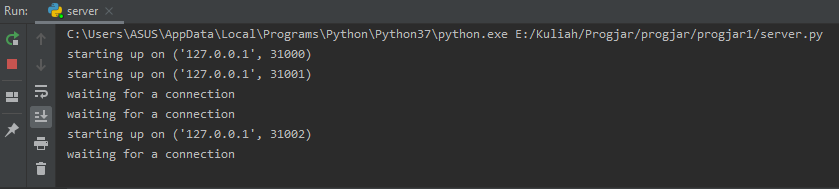
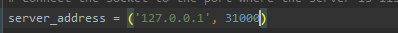
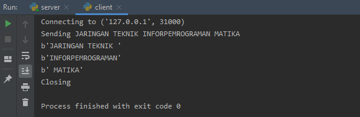
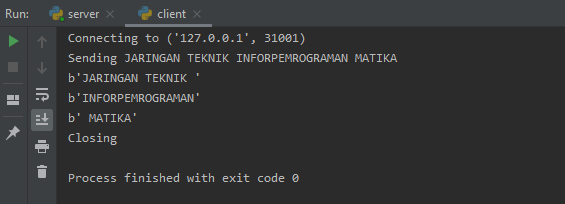
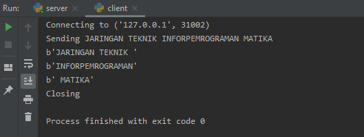
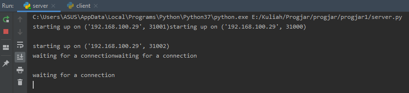
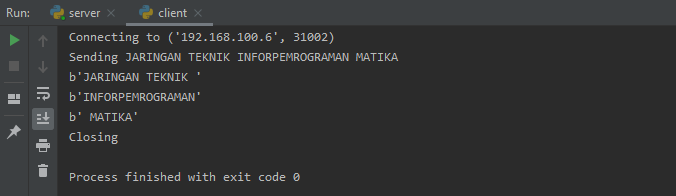
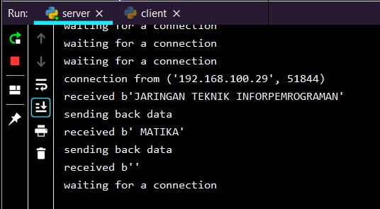
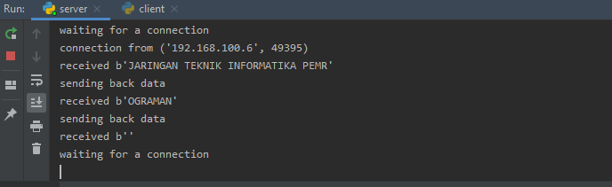

**Nama**  : Ramadhan Ilham Irfany 
**NRP**   : 05111740000121 
**Kelas** : Progjar - B

# Tugas 1
## Jalankan program server.py di 3 port yang berbeda (31000, 31001, 31002)
- Server berjalan pada 3 port

## Jalankan program client.py untuk konek ke server yang jalan pada poin sebelumnya dan mengirimkan string “JARINGAN TEKNIK INFORPEMROGRAMAN MATIKA” 
- Jalankan client dengan memodifikasi port dari server yang akan dituju

- Karena terdapat 3 port server maka hubungkan ke masing-masing port

Client menuju port 31000

Client menuju port 31001

Client menuju port 31002

## Jalankan program server.py di 3 port yang berbeda di 2 komputer yang berbeda dan jalankan program client.py untuk konek ke server pada poin sebelumnya, kirimkan string yang sama

- Menjalankan server.py pada PC saya (IP: 192.168.100.29)

- Menjalankan client.py pada PC saya, menghubungkan pada PC lain (IP: 192.168.100.6)

- Hasil dari PC lain (IP: 192.168.100.6) menerima pesan dari client.py pada PC saya (IP: 192.168.100.29)

- Hasil dari PC saya (IP: 192.168.100.29) menerima pesan balik dari client.py pada PC lain (IP: 192.168.100.6)
 
 

## MODIFIKASILAH program client.py dan server.py agar dapat MENTRANSFER file dari client ke server (letakkan program modifikasi di direktori tugas1a)

## MODIFIKASILAH program server.py agar dapat mengirimkan MENTRANSFER FILE yang di request oleh client (letakkan program modifikasi di direktori tugas1b) 
