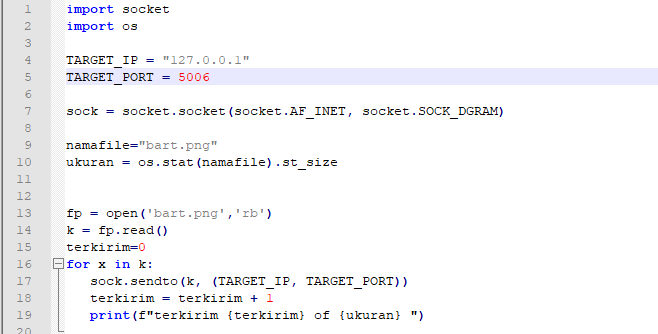
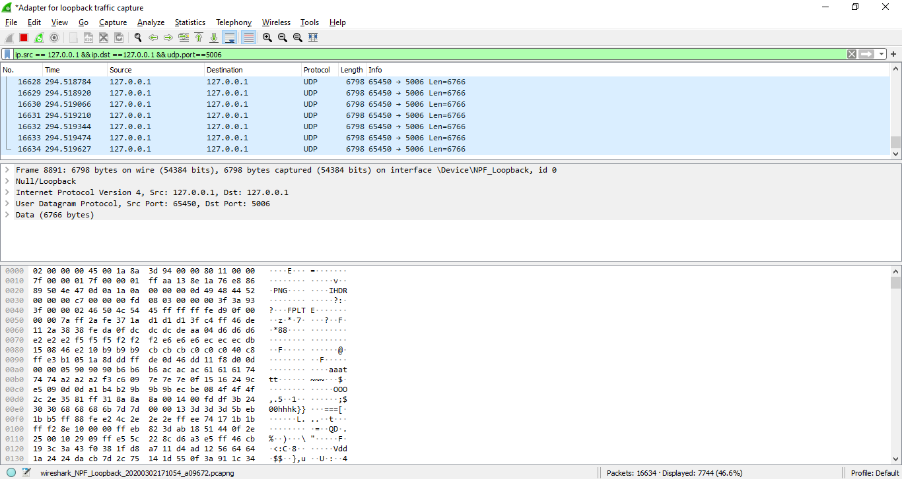
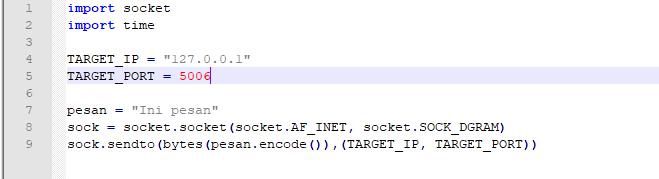
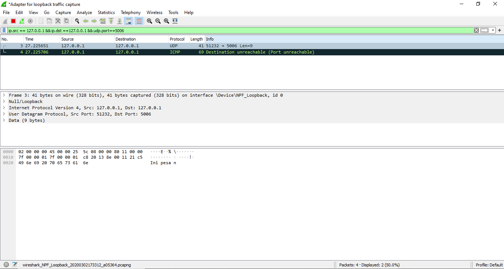

**Nama**  : Ramadhan Ilham Irfany 
**NRP**   : 05111740000121 
**Kelas** : Progjar - B

# Tugas 2
## Menggunakan wireshark, capture:

### Hasil keluaran dari program udpfileclient.py ke alamat 127.0.0.1 ke port 5006
1. Atur alamat IP dan port pada file udpfileclient.py dengan TARGET_IP menjadi 127.0.0.1 dan TARGET_PORT menjadi 5006

2. Buka wireshark, buka menu 'Adaptor Loopback traffic capture', lalu isikan filter dengan "ip.src == 127.0.0.1 && ip.dst ==127.0.0.1 && udp.port==5006" 
3. Hasil capture

### Hasil keluaran dari program udp_simple.py ke alamat 127.0.0.1 ke port 5006

1. Atur alamat IP dan port pada file udp_simple.py dengan TARGET_IP menjadi 127.0.0.1 dan TARGET_PORT menjadi 5006

2. Buka wireshark, buka menu 'Adaptor Loopback traffic capture', lalu isikan filter dengan "ip.src == 127.0.0.1 && ip.dst ==127.0.0.1 && udp.port==5006" 
3. Hasil capture

