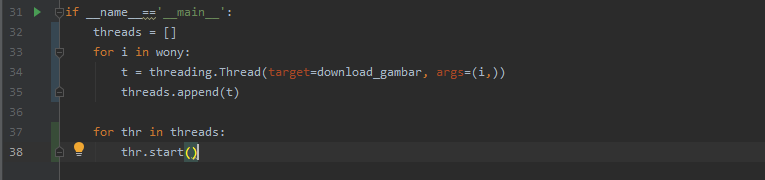
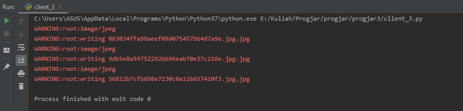

**Nama**  : Ramadhan Ilham Irfany<br>
**NRP**   : 05111740000121<br>
**Kelas** : Progjar - B

# Tugas 3
## Modifikasilah file program client_3.py agar dapat mengunduh lebih dari satu gambar menggunakan thread.
1. Tambahkan thread pada fungsi main



2. URL gambar yang akan saya download:
```py
    wony = ['https://i.pinimg.com/originals/9d/b5/e8/9db5e8a59752292bb96eab70e37c216e.jpg',
            'https://i.pinimg.com/originals/08/30/34/083034ffa98aeef09d075457bb4d7a9e.jpg',
            'https://i.pinimg.com/originals/56/81/2b/56812b7cfb898e7230c0a126657410f3.jpg']
    ]
```

3. Jalankan client_3.py dan akan muncul pada terminal seperti gambar berikut



4. Daftar gambar yang di download


