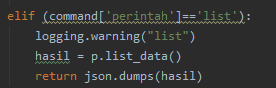
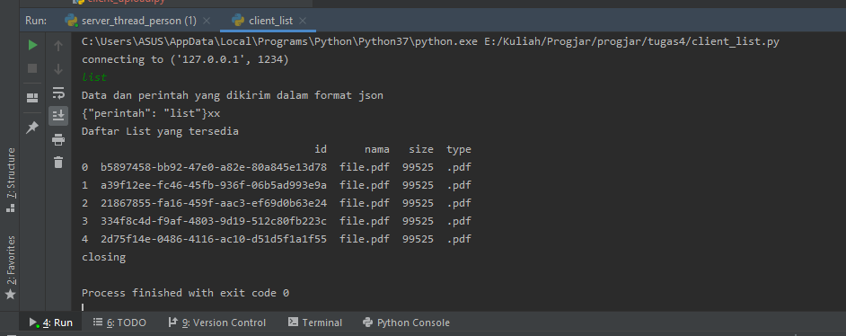

**Nama**  : Ramadhan Ilham Irfany 
**NRP**   : 05111740000121 
**Kelas** : Progjar - B

# Tugas 4

## Rancanglah sebuah protokol untuk:

### Meletakkan file

- Dari code person.py modifikasi fungsi create_data menjadi upload_data dengan 3 variabel yaitu nama, size dan type

- Dari code person_machine.py modifikasi fungsi proses pada perandaian command upload menggunakan data berbentuk json seperti berikut

- Dari code server_thread_person.py modifikasi fungsi run pada perandaian command upload menjadi seperti berikut

protokol akan menyimpan file pada folder protocol-storage

### Mengambil file

- Dari code person.py modifikasi fungsi get_data menjadi download_data seperti berikut

- Dari code person_machine.py modifikasi fungsi proses pada perandaian command download menggunakan data berbentuk json seperti berikut

- Dari code server_thread_person.py modifikasi fungsi run pada perandaian command download menjadi seperti berikut

protokol akan mengirimkan data ke client untuk disimpan pada folder client-storage

### Melihat list file

- Dari code person_machine.py modifikasi fungsi proses pada perandaian command list menggunakan data berbentuk json seperti berikut

- Dari code server_thread_person.py modifikasi fungsi run pada perandaian command list menjadi seperti berikut

protokol akan mengirimkan list ke client

## Buatlah dokumentasi dari protokol tersebut berisikan:

### Ketentuan membaca format & Daftar Fitur

### Cara melakukan request & Apa respon yang didapat

- Sebelum menjalankan client jalankan server(protokol) terlebih dahulu

- Meletakkan file
Jalankan client_upload.py dan masukkan perintah "upload<spasi>[nama file].[ekstensi]"
  
  
  
  client akan mengirimkan string bebentuk json ke server, setelah mendapat balasan dari server maka file berhasil diupload

Server akan menerima string berbentuk json dan menjalankannya kemudian membalas "OK"

  
  
File berhasil diletakkan ke protocol-storage

  

- Mengambil file
Jalankan client_download.py dan masukkan perintah "download<spasi>[nama file].[ekstensi]"
  
  
  
  client akan mengirimkan string bebentuk json ke server, setelah mendapat balasan dari server maka client akan mendownload file ke client-storage

Server akan menerima string berbentuk json dan mengecek apakah file sudah ada dan mengirimkan balasan ke client untuk mendownload

  
  
File berhasil didownload ke protocol-storage

  

- Melihat list file
Jalankan client_list.py dan masukkan perintah "list"
  
  
  
  client akan mengirimkan string bebentuk json ke server, setelah mendapat balasan dari server maka client akan menampilkan list

## Gunakan format JSON untuk tugas ini

-

## Buatlah client untuk setiap operasi tersebut

- client_upload.py untuk menghandle operasi meletakkan file

- client_download.py untuk menghandle operasi mengambil file

- client_list.py untuk menghandle proses melihat list

