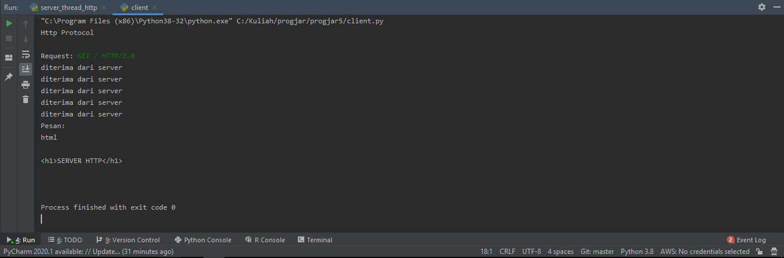
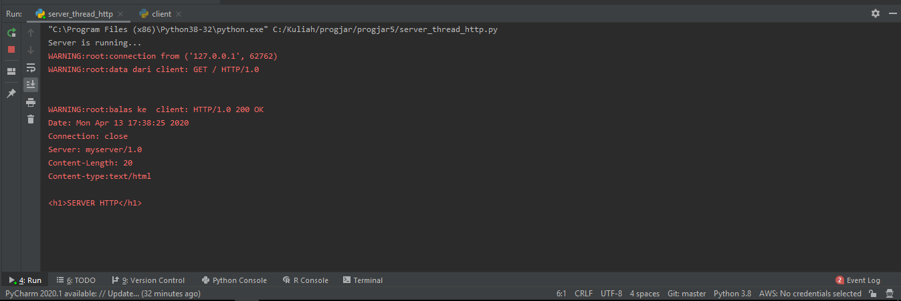
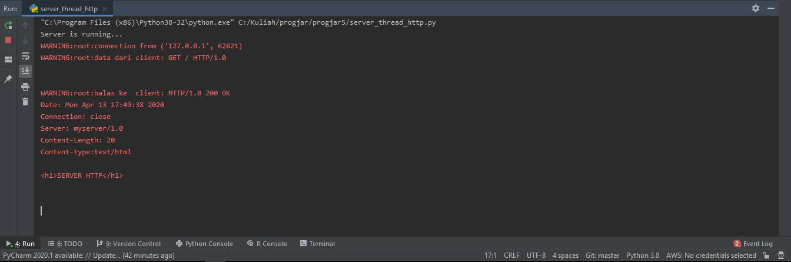
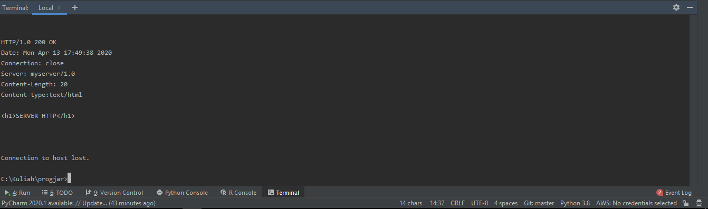
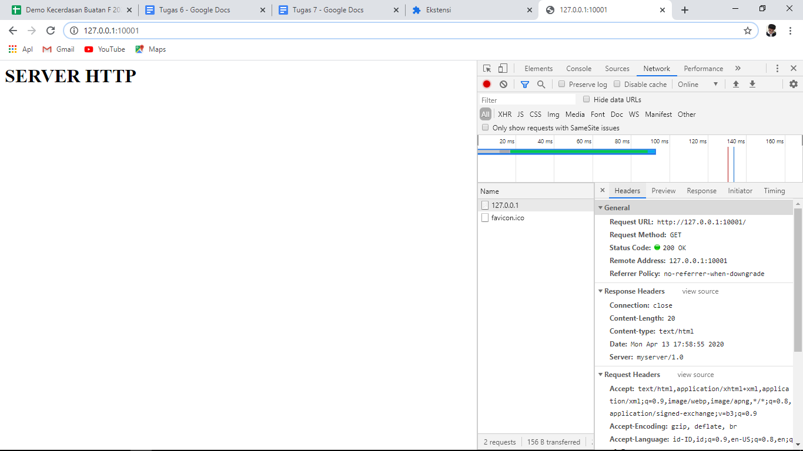
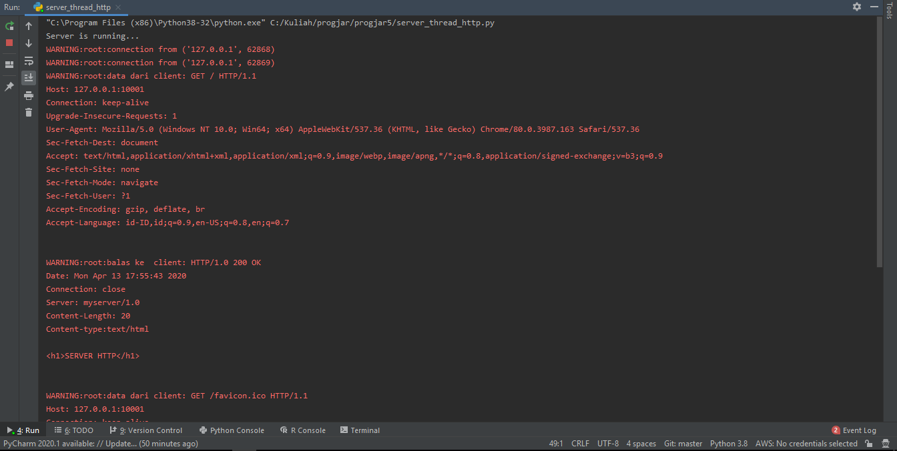

**Nama**  : Ramadhan Ilham Irfany 
**NRP**   : 05111740000121 
**Kelas** : Progjar - B

# Tugas 6
## Modifikasilah file program client_3.py agar dapat mengunduh lebih dari satu gambar menggunakan thread.
### Hasil request dari client.py

### Hasil dari server ketika request dari client.py dijalankan

### Hasil request dari telnet

### Hasil dari server ketika request dari telnet dijalankan

### Hasil request dari browser pada developer mode

### Hasil dari server ketika request dari browser pada developer mode dijalankan

